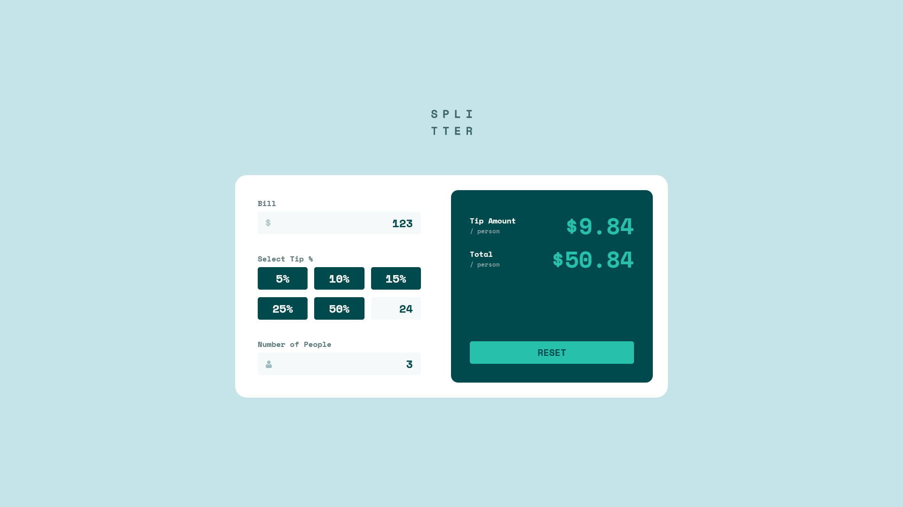
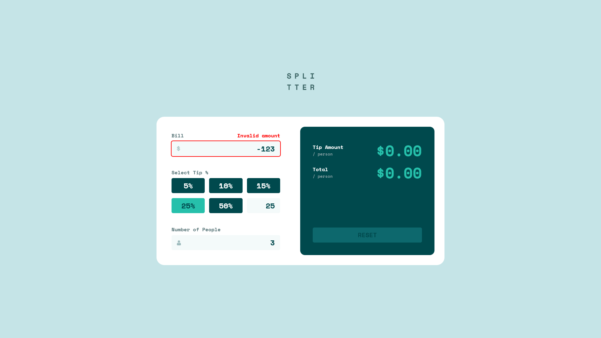
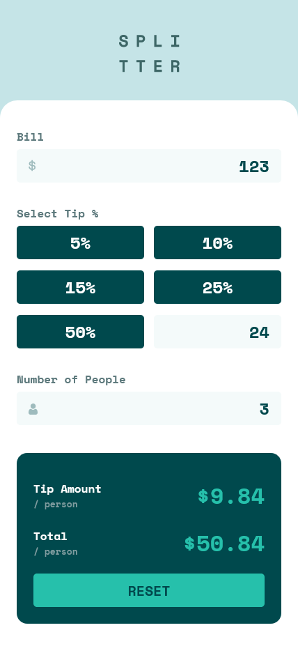

# Frontend Mentor - Tip calculator app solution

This is a solution to the [Tip calculator app challenge on Frontend Mentor](https://www.frontendmentor.io/challenges/tip-calculator-app-ugJNGbJUX).

## Table of contents

- [Overview](#overview)
  - [The challenge](#the-challenge)
  - [Screenshot](#screenshot)
  - [Links](#links)
- [Built with](#built-with)
- [Known bugs](#known-bugs)
- [Author](#author)

## Overview

### The challenge

Users should be able to:

- View the optimal layout for the app depending on their device's screen size
- See hover states for all interactive elements on the page
- Calculate the correct tip and total cost of the bill per person

### Screenshots

### Links

- Solution at [Github](https://github.com/zxasc/tip-calculator-app)
- Live Site at [Netlify](https://melodious-alfajores-080ba9.netlify.app/)

## Built with

- Semantic HTML5 markup
- CSS custom properties
- CSS modules
- Flexbox
- CSS Grid
- Desktop-first workflow
- [React](https://reactjs.org/) - JS library
- [Sass](https://sass-lang.com/) - CSS Preprocessor

## Known bugs

- Firefox and Safari: `<input type="number">` allows characters other than numbers

## Author

- Website - [lechocki.com](https://lechocki.com)